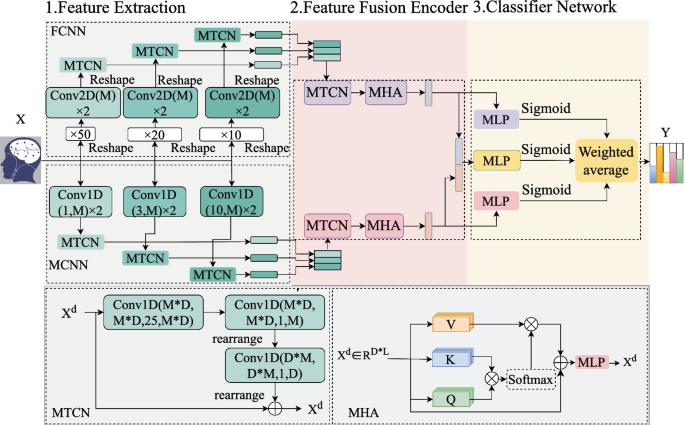

Your can star the train_main after pip all this need. The requirement is coming soon.
After eveluate you can see the result in saved/classfier_result

For details, please see the paper: https://link.springer.com/chapter/10.1007/978-981-97-8499-8_9

This paper has been included in the PRCV conference.
